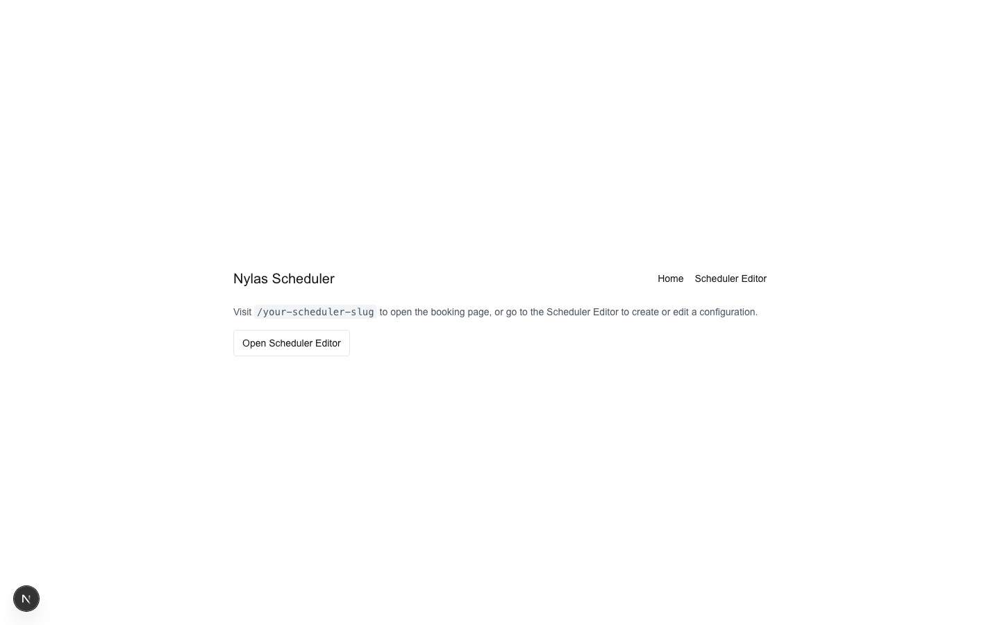
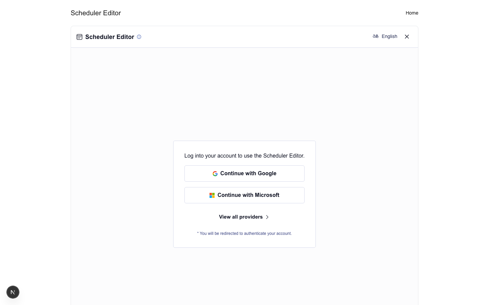
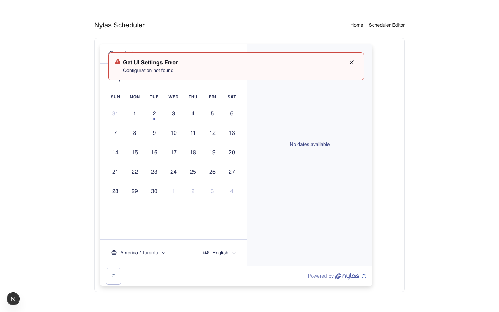

## Next.js Scheduler Quickstart

This repository contains two side‑by‑side Next.js samples that integrate Nylas Scheduler using the same, minimal UI:

- [app-router/](app-router) — Next.js App Router
- [page-router/](page-router) — Next.js Pages Router

Both examples are functionally identical and do not share code.

### Screenshots

Home



Scheduler Editor



Scheduling Page



## Getting Started

Each implementation includes its own README with setup steps, routes, and usage notes. Start in the folder you want to run:

1) App Router

```bash
cd app-router
npm install
npm run dev
```

2) Pages Router

```bash
cd page-router
npm install
npm run dev
```

Environment variables are read from `.env.local` (App Router) or `.env.development` (Pages Router). See each README.

## Requirements

- Node.js 20.x or higher
- npm or pnpm

## License

MIT
