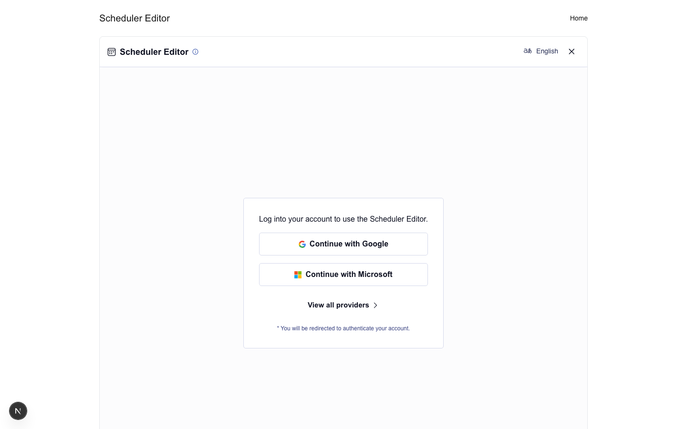

## Next.js Scheduler with App Router

This sample shows how to integrate Nylas Scheduler in a Next.js App Router app using a clean, minimal UI.

## Prerequisites

- Node.js 20.x or higher
- npm or pnpm
- A Nylas developer account and client ID

## Environment Setup

This project uses environment variables for configuration:

1. Create a `.env.local` file by copying the example file:

```bash
cp .env.example .env.local
```

2. Update the values in `.env.local` with your actual configuration:

```
# Required - Your Nylas application client ID
NEXT_PUBLIC_NYLAS_CLIENT_ID=your_actual_client_id

# Optional - Defaults to https://api.us.nylas.com/v3
# Use https://api.eu.nylas.com/v3 for EU data residency
NEXT_PUBLIC_NYLAS_API_ENDPOINT=https://api.us.nylas.com/v3
```

## Installation and Setup

1. Install dependencies:

```bash
npm install
# or
pnpm install
```

2. Build the application:

```bash
npm run build
# or
pnpm build
```

3. Start the development server (Turbopack enabled):

```bash
npm run dev
# or
pnpm dev
```

4. Open [http://localhost:3000](http://localhost:3000).

## Screenshots

Home


Scheduler Editor



Scheduling Page


### Routes

- Home: `/`
- Scheduler Editor: `/scheduler-editor`
- Scheduling Page by slug: `/{slug}` or `/scheduling-page?slug=...`
- Manage booking by reference: `/booking-ref/{bookingRef}/cancel` and `/booking-ref/{bookingRef}/reschedule`

### Notes

- Nylas UI components are rendered client-side only via dynamic imports.
- The Scheduler Editor preview links point to `/{slug}`; email callbacks use the `booking-ref` routes above.

## Documentation

For more information about the Nylas Scheduler component, refer to the [Nylas documentation](https://developer.nylas.com/docs/v3/scheduler/).

## License

This project is MIT licensed.

