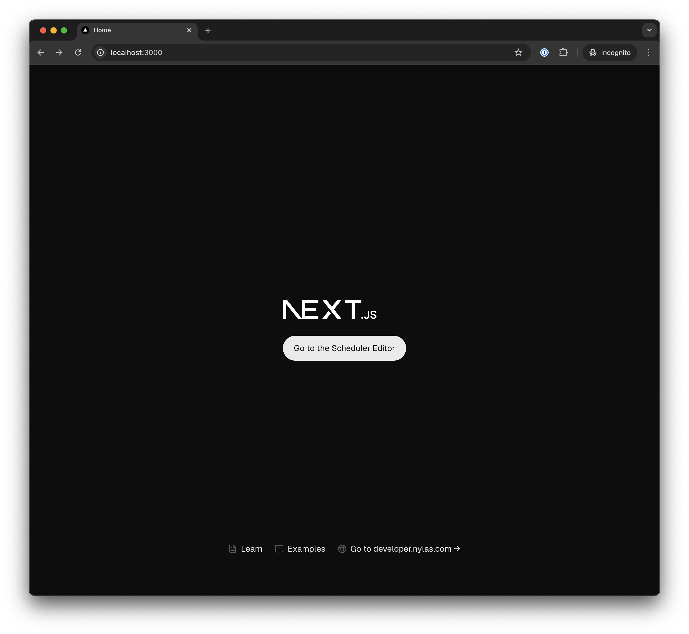
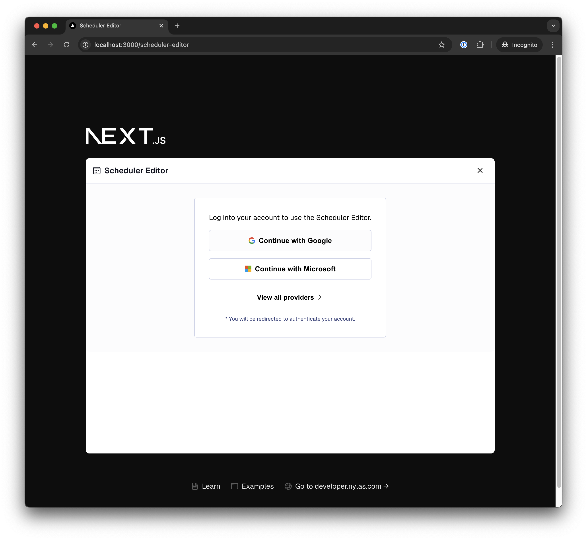
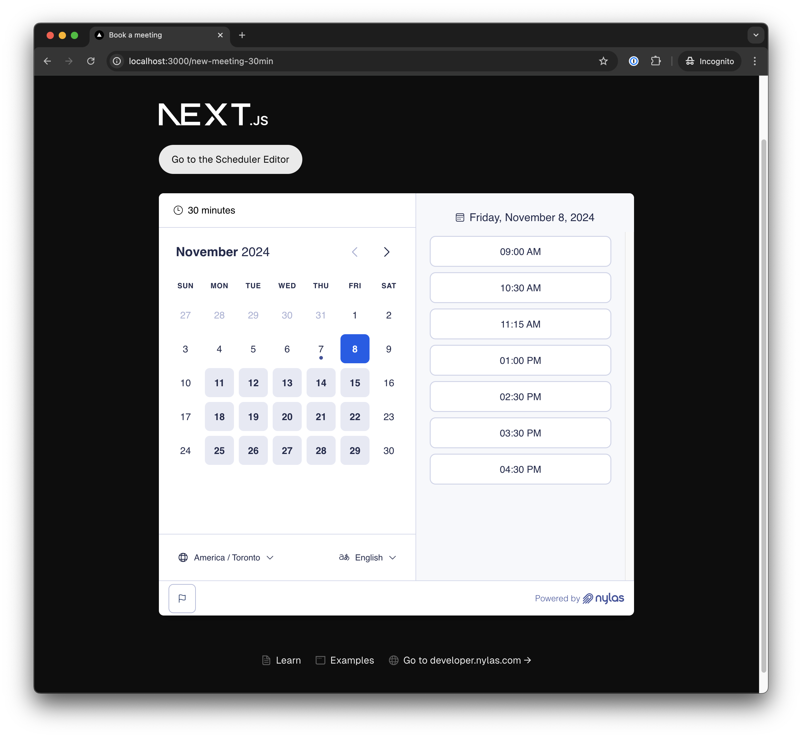

# Nylas v3 Scheduler!

📖 See the [Next.js docs](https://nextjs.org/docs) for details on supported features for Next.js project.


## Prerequisites

- Node v20 or higher
- Nylas Application (Client ID) see our [docs](https://developer.nylas.com/docs/v3/getting-started/scheduler/#set-up-your-nylas-account) for more information.
- Nylas callback URI configured for `http://localhost:3000/scheduler-editor` see our [docs](https://developer.nylas.com/docs/v3/getting-started/scheduler/#register-callback-uri) for more information.
- Create a `.env.development` file in the root of the project and add the following environment variables.
    ```bash
    NEXT_PUBLIC_NYLAS_CLIENT_ID=<YOUR_NYLAS_CLIENT_ID>
    NEXT_PUBLIC_NYLAS_API_ENDPOINT=https://api.us.nylas.com/v3
    ```
## Running the project

1. First install all dependencies by running the following command in the root of the project.
    ```bash
    npm install
    ```

2. Start the development server by running the following command in the root of the project.
    ```bash
    npm run dev
    ```

3. Open [http://localhost:3000](http://localhost:3000) with your browser to see the result.


## Pages

### Home Page
The home page is the landing page of the application. It contains a button that redirects to the scheduler editor page.



### Scheduler Editor Page
The scheduler editor page is where you can create a new scheduling page and configure the event details.



### Scheduling Page
The scheduling page is where you can view the available time slots and select a time slot to schedule an event for a given scheduling page.


